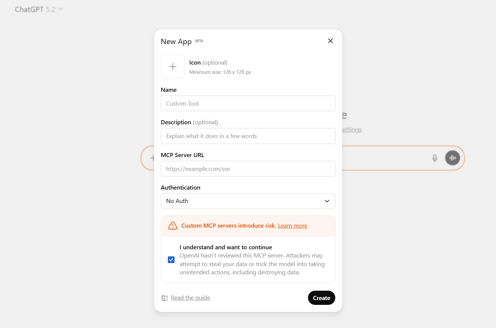
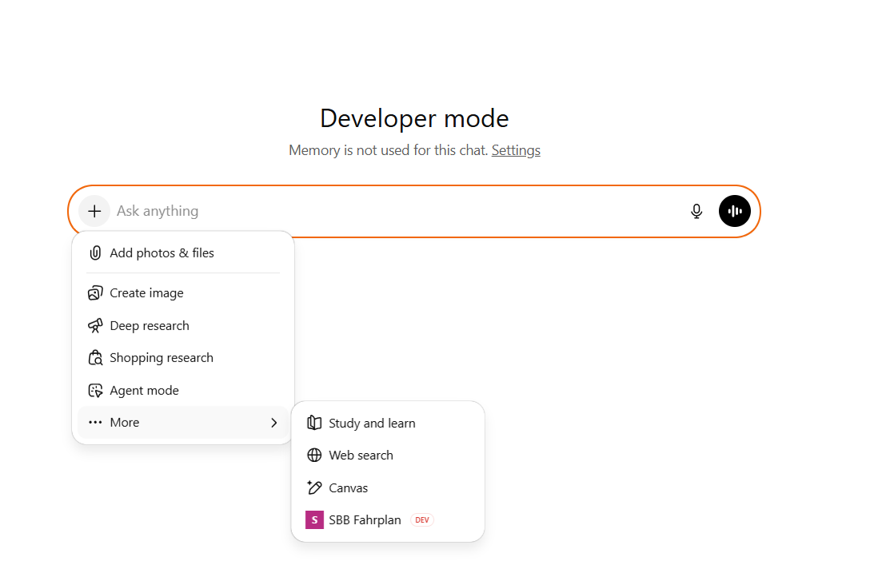
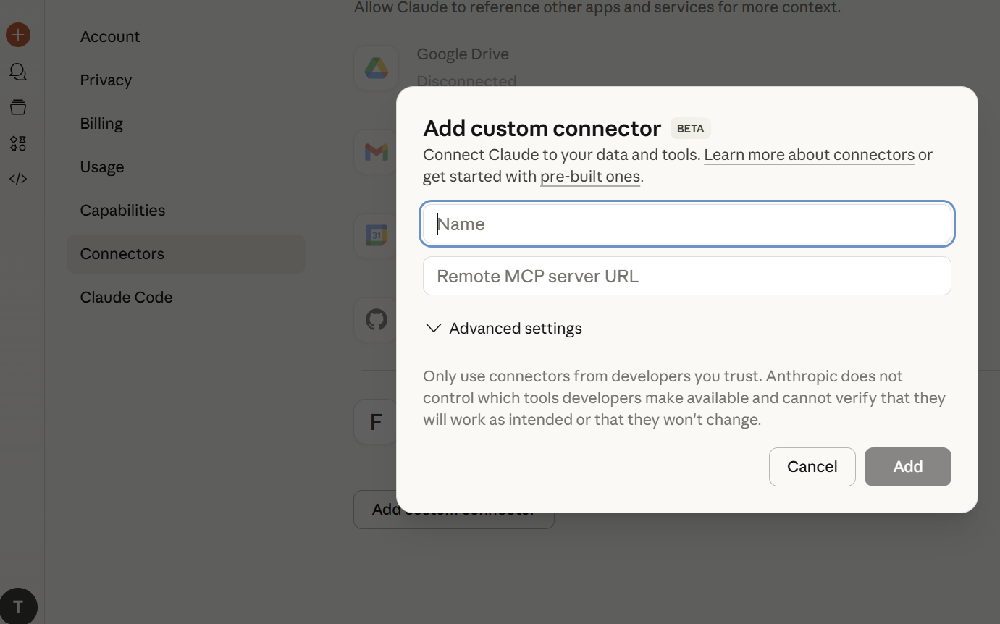
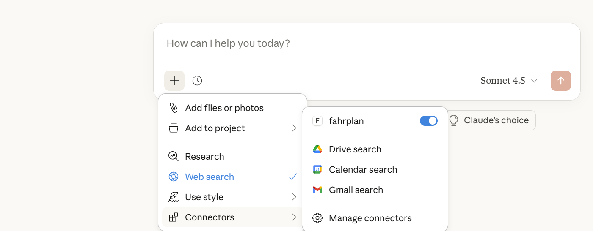
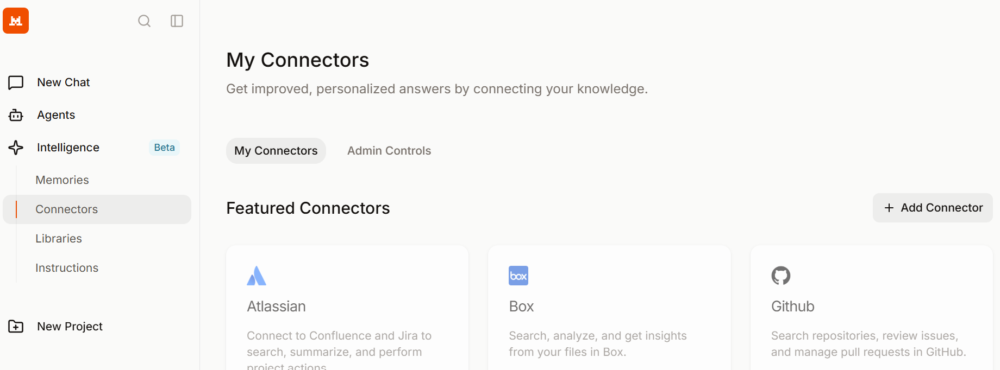
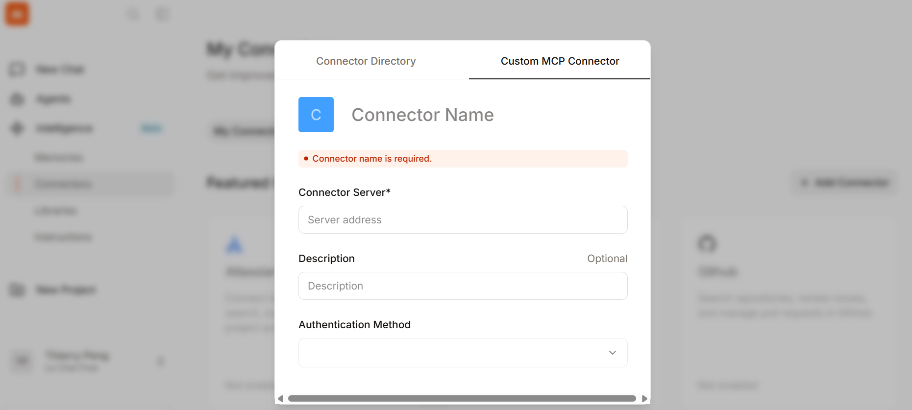
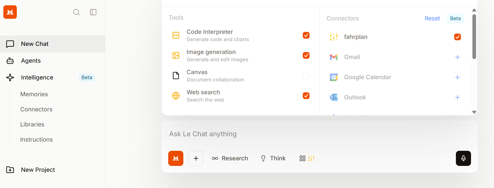

# chattender-fahrplan MCP – UI Configuration Guide

> **MCP Server URL**
>
> The MCP Server URL is https://chattender-fahrplan-mcp-971368006395.europe-west6.run.app/mcp

> **Caution**
> 
> The server may require authentication and will be shut down after January 2026. 
> There are no warranties about completeness and accuray of this MCP. LLMs may introduce hallucinations
> in the answers.
> This is a study project and no official product of SBB. 
> Always check the timetable at [Swiss Federal Railways (SBB)](https://www.sbb.ch)

---

## ChatGPT (Web UI)

### 1. Enable Developer Mode

* Open **Settings** → **Apps & Connectors**
* Enable **Developer mode (Beta)**
* Note: Memory disabled, higher risk acknowledged

### 2. Create Custom MCP App

* Click **Add App / New App**
* Fill in:

    * **Name**: `chattender-fahrplan`
    * **Description**: optional
    * **MCP Server URL**: https://chattender-fahrplan-mcp-971368006395.europe-west6.run.app/mcp
    * **Authentication**: No Authentication
* Confirm risk acknowledgement

### 3. Verify Connector Availability

* Connector appears in tool selector
* Enable it per chat if required

---

## Claude (Web UI)

### 1. Open Connectors

* Go to **Settings** → **Connectors**
* Choose **Add custom connector (Beta)**

### 2. Add MCP Connector

* Enter:

    * **Name**: `chattender-fahrplan`
    * **Remote MCP server URL**: https://chattender-fahrplan-mcp-971368006395.europe-west6.run.app/mcp
* Advanced settings: leave default unless instructed

### 3. Use in Chat

* Activate connector via chat toolbar
* Claude can now call the MCP tools

---

## Le Chat (Web UI)

### 1. Open Connectors Section

* Navigate to **Connectors** in sidebar
* Click **Add Connector**

### 2. Configure Custom MCP Connector

* Fill in:

    * **Connector Name**: `chattender-fahrplan`
    * **Connector Server**: https://chattender-fahrplan-mcp-971368006395.europe-west6.run.app/mcp
    * **Authentication Method**: No Authentication

### 3. Enable Connector in Workspace

* Toggle connector on
* Verify it appears in the active tools list
