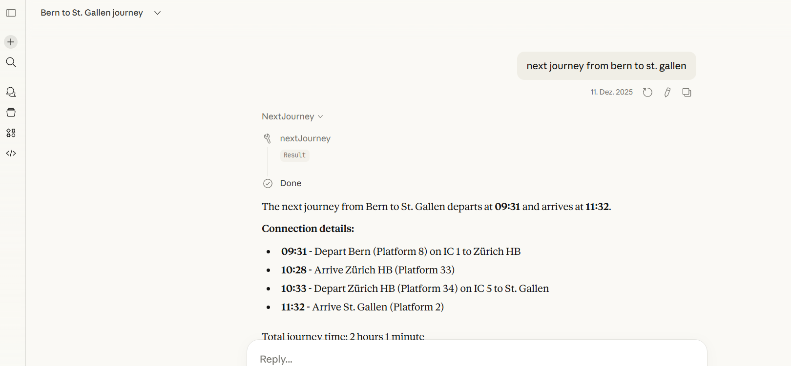
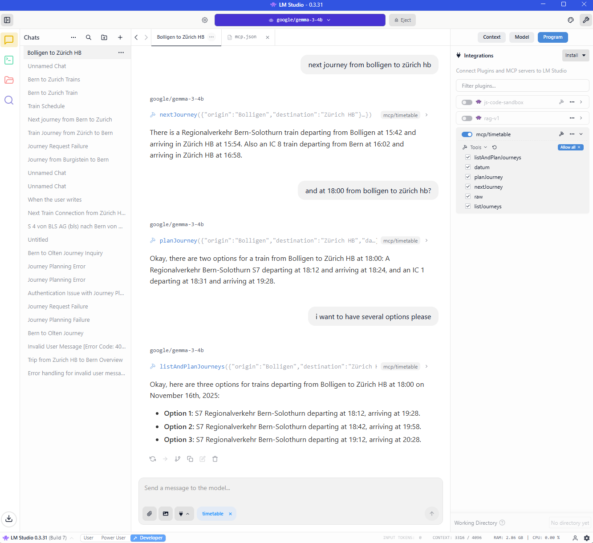
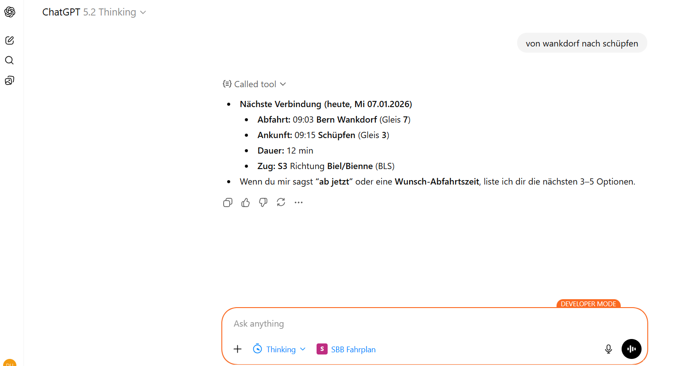
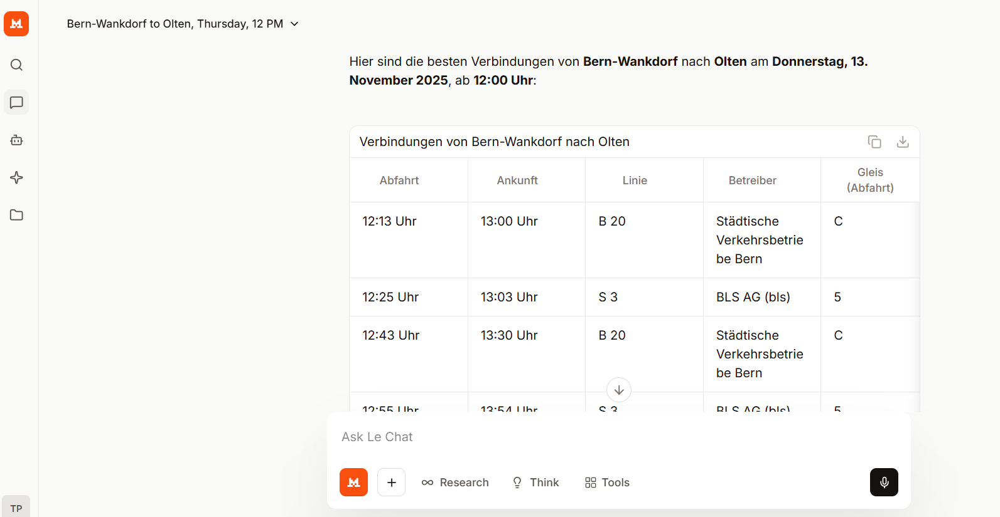

# 🚆 Der chattende Fahrplan – a Swiss Timetable MCP Server

A **Spring AI / MCP-compatible server** that provides **SBB timetable information** to language models.  
Enables *bring-your-own LLM* scenarios to interact with the SBB timetable.  
This is an **experimental study project** with **no warranties** regarding accuracy, completeness, or runtime behavior.

Inspired by the 1996 “Sprechender Fahrplan” by SBB

---

## Overview

The repository extends the MCP-compatible Spring Boot server with five LLM tools for Swiss railway journey planning.

These tools allow large language models to query the SBB Journey API directly, selecting the correct function depending on user intent and time context.

### Tools

- **nextJourney** – returns a natural-language description of the next available connection between two stations (used for “now”, “next train”, “soon”).
- **planJourney** – returns the next available connection after a specific ISO datetime (used for “today at 14:35”, “tomorrow 07:10”).
- **listJourneys** – returns several upcoming connections for today as JSON (used for “show me the options”).
- **listAndPlanJourneys** – returns several connections starting from a given datetime as JSON (used for “show me trains after 16:00”).
- **raw** – returns the unprocessed JSON response from the SBB Journey Service (for debugging or analysis).  
  *Note: this method often overwhelms smaller language models with limited context windows due to the large JSON payload size.*

An additional helper tool **datum** provides today’s date in ISO format for date resolution.

---

## Components in the Repository

- **infrastructure** – infrastructure and security components
- **journeyservice** – integration with the SBB journey service
- **mapping** – mapping from journey-service data to LLM-digestible datatypes
- **TimetableTool** – exposes the MCP tools
- **Minimal Jinja Template** – used for LM Studio integration with Apertus
- **Example MCP Snippet** – shows how to connect a local MCP-server with LM Studio

---

## Integration with LLMs

The MCP server can be connected to various LLM runtimes and frontends.  
Below is an overview of tested integrations:

| Interface | LLM Vendor    | LLM Model          | MCP Runtime | Text | Voice In | Voice Out |
|-----------|---------------|--------------------|--------------|------|---------|----------|
| LM Studio | Google        | Gemma-3 270m       | local        | ❌    | ❌ | ❌ |
| LM Studio | Google        | Gemma-3 1b         | local        | ❌    | ❌ | ❌ |
| LM Studio | Google        | Gemma-3 4b         | local        | ✅    | ❌ | ❌ |
| LM Studio | Swiss AI      | Apertus 8B         | local        | ❌    | ❌ | ❌ |
| LM Studio | Alibaba Cloud | Qwen3 8B           | local        | ✅    | ❌ | ❌ |
| LM Studio | OpenAI        | OSS GPT 20B        | local        | ✅    | ❌ | ❌ |
| Le Chat   | Mistral AI    | Mistral Large 123B | GCP          | ✅    | ✅ | ❌ |
| Claude    | Anthropic     | Claude Sonnet 4.5  | GCP          | ✅    | ✅ | ✅ |
| ChatGPT   | OpenAI        | GPT-5              | GCP          | ✅    | ✅ | ❌ |

Legend:  
✅ = verified working  
❌ = not supported  / did not work
---

## Results

The following use cases and benefits have been tested: 
- The next connection with an origin and destination 
- Planned connection 
- Multiple options
- Journeys with (multiple) stopover 
- Itinerary planning
- Multilanguage support 

Below are some screenshots from the running prototype, integrated with various MCP-hosts and models

Integrated with Claude web, displaying request and response

Integrated with LMStudio and gemma3-4b from Google. This was the smallest model which could be integrated successfully with the MCP-server.  

Integration with ChatGPT. The developer mode is required because of security reasons.

Very good speech-to-text model (swiss station names matter!). Used on a handheld with the lechat app. 

## Challenges

The following challenges had to be overcome:
- Keeping the token size of the instructions as small as possible for integrating it with smaller models
- Creating dataformat and structures which let smaller models with limited token size work with the mcp server and still get benefit from the bigger cloud models
- Preventing language switching caused by the server's response language
- Date and time calculation: The tested MCP-Hosts / LLM do not have the same behavior regarding date / time. Sometimes the date is present, the exact time almost never. 
- Security / isolation

---

## Runtime

The MCP server runs on:

- **Local** – requires Java 21; define
    - `JOURNEY_SERVICE_BASE`
    - `MCP_API_KEY`
    - `JOURNEY_SERVICE_CLIENT_ID`
    - `JOURNEY_SERVICE_CLIENT_SECRET`

- **GCP** – deployable on Cloud Run (see `cloudbuild.yaml` and `project.toml`); configured for Zurich.  
  Define the same environment variables as above.  
  Cloud deployment is required to interface with publicly available models (e.g., Mistral).

---

## Limitations

- **Apertus models** integration failed mostly due to missing tool support.
- **Journey-service integration** currently does not handle all edge cases. Lacks situations, picks first station match, doesn't communicate clearly if a train is delayed. 
- **Gemini** is not supported because the MCP capability is only available with the cli / sdk.
- **Authentication** no clean OAuth integration done. Only API-keys which are not supported by the MCP spec

---

## Future Work

The GCP deployment from the CAS thesis phase has been decommissioned. Development continues with a similar integration. 
This time not with SBB APIs but with the open-data APIs from https://opentransportdata.swiss/. 
The https://github.com/thpeng/unendliche-reise-mcp focuses on better UX (e.g. elicitation) and improved security against
vulnerabilities as shown with the companion material from https://github.com/thpeng/lokis-mcp. 

## Acknowledgments

- **Swiss AI** – for the Apertus model (somewhat disappointing due to missing MCP/tool support and the claim that “Totemügerli” is a peak in Valais ;) )
- **DSO KIS** – for providing journey-service access
- **@blancsw** – for the Jinja template basis (see [Hugging Face discussion](https://huggingface.co/swiss-ai/Apertus-8B-Instruct-2509/discussions/18))
- **ChatGPT** – for the vibe coding sessions 

---
